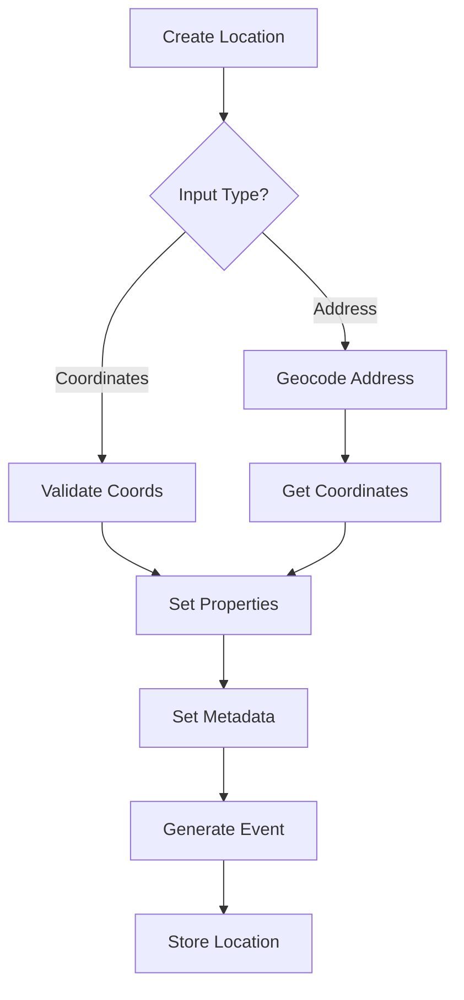
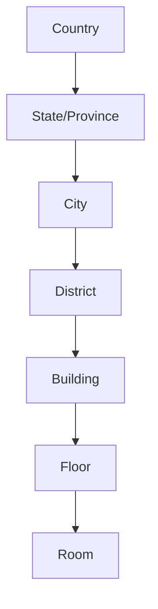
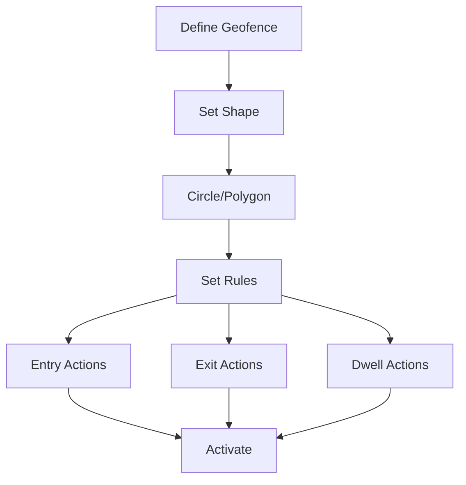
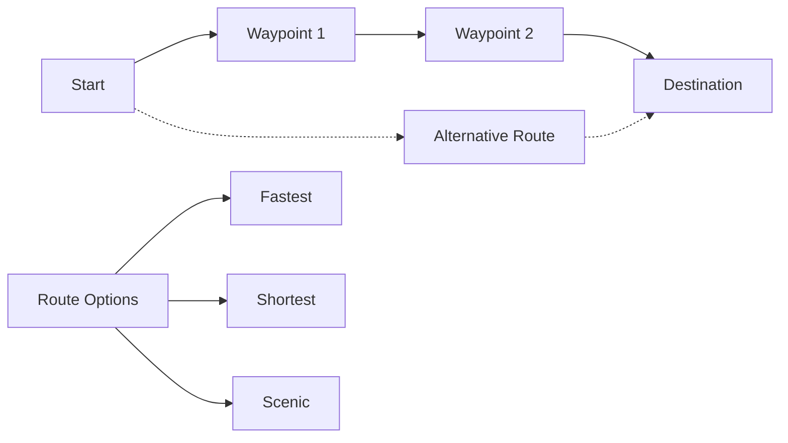
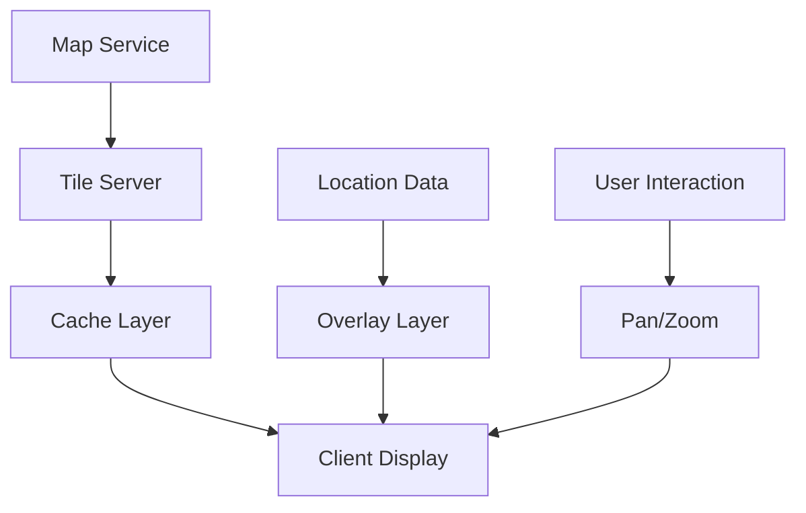

# User Stories for Location Domain

## Overview

User stories for the Location domain module, which manages geographic data, spatial relationships, location-based services, and geospatial analytics in the CIM system.

## Location Management

### Story L1: Create Location Entity
**As a** location manager  
**I want** to create location entities  
**So that** physical places are represented in the system

**Acceptance Criteria:**
- Location created with unique ID
- Coordinates (latitude, longitude, altitude)
- LocationCreated event generated
- Address geocoding supported
- Multiple coordinate systems

**Mermaid Diagram:**

**Tests:** `test_create_location`, `test_geocoding`

### Story L2: Define Location Boundaries
**As a** geographic administrator  
**I want** to define location boundaries  
**So that** areas and regions are properly mapped

**Acceptance Criteria:**
- Polygon/multipolygon support
- BoundaryDefined event generated
- Area calculation
- Boundary validation
- Nested boundaries

**Tests:** `test_define_boundaries`, `test_boundary_validation`

### Story L3: Update Location Information
**As a** location manager  
**I want** to update location details  
**So that** information stays current

**Acceptance Criteria:**
- Metadata updates (name, type, description)
- LocationUpdated event generated
- History tracking
- Coordinate precision
- Time zone updates

**Tests:** `test_update_location`, `test_location_history`

## Spatial Relationships

### Story L4: Link Locations Hierarchically
**As a** geographic administrator  
**I want** to create location hierarchies  
**So that** containment relationships are clear

**Acceptance Criteria:**
- Parent-child relationships
- LocationsLinked event generated
- Multiple hierarchy types
- Circular reference prevention
- Traversal queries

**Mermaid Diagram:**

**Tests:** `test_location_hierarchy`, `test_hierarchy_traversal`

### Story L5: Calculate Distances
**As a** user  
**I want** to calculate distances between locations  
**So that** I can plan routes and proximity

**Acceptance Criteria:**
- Multiple distance calculations (Haversine, Vincenty)
- DistanceCalculated event generated
- Unit conversions
- Route distance vs direct distance
- Elevation consideration

**Tests:** `test_distance_calculation`, `test_route_planning`

### Story L6: Find Nearby Locations
**As a** user  
**I want** to find locations near a point  
**So that** I can discover relevant places

**Acceptance Criteria:**
- Radius-based search
- NearbyLocationsFound event generated
- Filter by location type
- Sort by distance
- Performance optimization

**Tests:** `test_nearby_search`, `test_spatial_indexing`

## Geofencing and Monitoring

### Story L7: Create Geofences
**As a** operations manager  
**I want** to create geofences  
**So that** location-based triggers work

**Acceptance Criteria:**
- Multiple geofence shapes
- GeofenceCreated event generated
- Entry/exit detection
- Overlap handling
- Schedule-based activation

**Mermaid Diagram:**

**Tests:** `test_create_geofence`, `test_geofence_triggers`

### Story L8: Monitor Location Changes
**As a** tracking system  
**I want** to monitor entity location changes  
**So that** movement is tracked

**Acceptance Criteria:**
- Real-time position updates
- LocationChanged event generated
- Movement history
- Speed calculation
- Anomaly detection

**Tests:** `test_location_monitoring`, `test_movement_tracking`

### Story L9: Detect Geofence Events
**As a** monitoring system  
**I want** to detect geofence crossings  
**So that** location-based actions trigger

**Acceptance Criteria:**
- Entry/exit detection
- GeofenceCrossed event generated
- Dwell time tracking
- Multiple fence handling
- Event deduplication

**Tests:** `test_geofence_detection`, `test_dwell_tracking`

## Location Services

### Story L10: Provide Geocoding Services
**As a** developer  
**I want** to convert addresses to coordinates  
**So that** text locations become mappable

**Acceptance Criteria:**
- Forward geocoding (address to coords)
- AddressGeocoded event generated
- Confidence scores
- Multiple results
- Fallback providers

**Tests:** `test_forward_geocoding`, `test_geocoding_accuracy`

### Story L11: Provide Reverse Geocoding
**As a** developer  
**I want** to convert coordinates to addresses  
**So that** locations are human-readable

**Acceptance Criteria:**
- Reverse geocoding (coords to address)
- CoordinatesReversed event generated
- Address components
- Localization support
- Precision levels

**Tests:** `test_reverse_geocoding`, `test_address_formatting`

### Story L12: Calculate Routes
**As a** user  
**I want** to calculate routes between locations  
**So that** I can navigate efficiently

**Acceptance Criteria:**
- Multiple routing profiles
- RouteCalculated event generated
- Turn-by-turn directions
- Alternative routes
- Traffic consideration

**Mermaid Diagram:**

**Tests:** `test_route_calculation`, `test_route_optimization`

## Location Analytics

### Story L13: Analyze Movement Patterns
**As an** analyst  
**I want** to analyze movement patterns  
**So that** I can understand behavior

**Acceptance Criteria:**
- Pattern recognition
- MovementPatternDetected events
- Heatmap generation
- Frequency analysis
- Predictive modeling

**Tests:** `test_pattern_analysis`, `test_movement_prediction`

### Story L14: Cluster Locations
**As an** analyst  
**I want** to cluster locations  
**So that** I can identify hotspots

**Acceptance Criteria:**
- Multiple clustering algorithms
- ClustersIdentified event generated
- Density-based clustering
- Hierarchical clustering
- Cluster visualization

**Tests:** `test_location_clustering`, `test_hotspot_detection`

### Story L15: Generate Location Reports
**As a** manager  
**I want** location-based reports  
**So that** I can make informed decisions

**Acceptance Criteria:**
- Configurable report templates
- LocationReportGenerated events
- Time-based analysis
- Export formats
- Scheduled generation

**Tests:** `test_location_reporting`, `test_report_scheduling`

## Integration Features

### Story L16: Import Geographic Data
**As a** GIS specialist  
**I want** to import geographic data  
**So that** existing data is utilized

**Acceptance Criteria:**
- Multiple format support (GeoJSON, KML, Shapefile)
- GeographicDataImported event generated
- Coordinate system conversion
- Data validation
- Batch import

**Tests:** `test_geo_import`, `test_format_conversion`

### Story L17: Export Location Data
**As a** user  
**I want** to export location data  
**So that** I can use it elsewhere

**Acceptance Criteria:**
- Multiple export formats
- LocationDataExported event generated
- Filtered exports
- Projection support
- Compression options

**Tests:** `test_location_export`, `test_export_filtering`

### Story L18: Integrate Map Services
**As a** developer  
**I want** to integrate map services  
**So that** locations are visualized

**Acceptance Criteria:**
- Multiple map providers
- MapServiceIntegrated event generated
- Tile caching
- Offline support
- Custom styling

**Mermaid Diagram:**

**Tests:** `test_map_integration`, `test_tile_caching`

## Privacy and Security

### Story L19: Anonymize Location Data
**As a** privacy officer  
**I want** to anonymize location data  
**So that** privacy is protected

**Acceptance Criteria:**
- Location fuzzing algorithms
- LocationAnonymized event generated
- Configurable precision reduction
- K-anonymity support
- Differential privacy

**Tests:** `test_location_anonymization`, `test_privacy_preservation`

### Story L20: Control Location Access
**As a** security administrator  
**I want** to control location access  
**So that** sensitive locations are protected

**Acceptance Criteria:**
- Location-based access control
- AccessControlSet event generated
- Clearance levels
- Time-based restrictions
- Audit trail

**Tests:** `test_location_access_control`, `test_security_zones`

## Legend

- 📍 Core location functionality
- 🗺️ Mapping and visualization
- 📊 Analytics and insights
- 🔐 Privacy and security

## Test Coverage Requirements

- Unit tests for all location operations
- Integration tests for spatial queries
- Performance tests for large datasets
- Accuracy tests for calculations
- Security tests for access control 