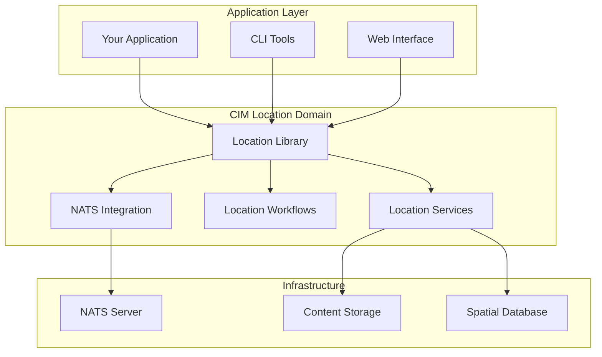

# CIM Location Domain Integration Guide

## Table of Contents
1. [Integration Overview](#integration-overview)
2. [Quick Start Guide](#quick-start-guide)
3. [Basic Location Operations](#basic-location-operations)
4. [Advanced Geospatial Features](#advanced-geospatial-features)
5. [NATS Integration](#nats-integration)
6. [Workflow Integration](#workflow-integration)
7. [Service Integration](#service-integration)
8. [Real-World Examples](#real-world-examples)
9. [Testing Integration](#testing-integration)
10. [Common Integration Patterns](#common-integration-patterns)

## Integration Overview

The CIM Location Domain provides comprehensive geospatial capabilities within the Composable Information Machine ecosystem. This guide demonstrates how to integrate location services, spatial operations, and geographic workflows into your applications.

### Architecture Overview



## Quick Start Guide

### Installation

Add the CIM Location Domain to your `Cargo.toml`:

```toml
[dependencies]
cim-domain-location = { path = "../cim-domain-location" }
tokio = { version = "1.0", features = ["full"] }
async-nats = "0.33"
serde = { version = "1.0", features = ["derive"] }
```

### Basic Setup

```rust
use cim_domain_location::{
    Location, Coordinates, LocationId,
    services::{GeocodingService, SpatialSearchService},
    nats::{LocationSubject, MessageIdentity},
};
use async_nats::Client;

#[tokio::main]
async fn main() -> Result<(), Box<dyn std::error::Error>> {
    // Initialize NATS connection
    let nats_client = async_nats::connect("nats://localhost:4222").await?;
    
    // Create a basic location
    let location = Location::new(
        LocationId::new(),
        "Coffee Shop".to_string(),
        Coordinates::new(40.7589, -73.9851)?, // NYC coordinates
    );
    
    println!("Created location: {}", location.name);
    println!("Coordinates: {}", location.coordinates);
    
    Ok(())
}
```

## Basic Location Operations

### Creating and Managing Locations

```rust
use cim_domain_location::{
    Location, Coordinates, Address, LocationMetadata,
    value_objects::{LocationType, Accuracy}
};

async fn create_comprehensive_location() -> Result<Location, LocationError> {
    // Create coordinates with accuracy information
    let coordinates = Coordinates::new_with_accuracy(
        40.7589,
        -73.9851,
        Accuracy::High, // GPS accuracy
    )?;
    
    // Create address information
    let address = Address::new()
        .with_street_number("123")
        .with_street_name("Main St")
        .with_city("New York")
        .with_state("NY")
        .with_postal_code("10001")
        .with_country("USA");
    
    // Create location metadata
    let metadata = LocationMetadata::new()
        .with_type(LocationType::PointOfInterest)
        .with_description("Popular coffee shop in downtown")
        .with_tags(vec!["coffee", "wifi", "outdoor-seating"])
        .with_website("https://example-coffee.com")
        .with_phone("+1-555-0123");
    
    // Create comprehensive location
    let location = Location::builder()
        .id(LocationId::new())
        .name("Central Coffee")
        .coordinates(coordinates)
        .address(Some(address))
        .metadata(metadata)
        .build()?;
    
    Ok(location)
}

async fn location_operations_example() -> Result<(), LocationError> {
    let mut location = create_comprehensive_location().await?;
    
    // Update location
    location.update_name("Central Coffee & Roasters")?;
    location.add_tag("artisan-coffee")?;
    
    // Calculate distance to another location
    let other_coordinates = Coordinates::new(40.7505, -73.9934)?; // Times Square
    let distance = location.coordinates.distance_to(&other_coordinates);
    println!("Distance to Times Square: {:.2} meters", distance);
    
    // Check if location is within a bounding box
    let bbox = BoundingBox::new(
        Coordinates::new(40.7500, -74.0000)?, // Southwest
        Coordinates::new(40.7600, -73.9800)?, // Northeast
    );
    
    if bbox.contains(&location.coordinates) {
        println!("Location is within the specified area");
    }
    
    Ok(())
}
```

### Working with Hierarchical Locations

```rust
use cim_domain_location::{
    LocationHierarchy, LocationRelationship, RelationshipType
};

async fn hierarchy_example() -> Result<(), LocationError> {
    // Create hierarchy: Country -> State -> City -> Neighborhood
    let country = Location::new(
        LocationId::new(),
        "United States".to_string(),
        Coordinates::new(39.8283, -98.5795)?, // Center of US
    );
    
    let state = Location::new(
        LocationId::new(),
        "New York".to_string(),
        Coordinates::new(42.1657, -74.9481)?, // Center of NY
    );
    
    let city = Location::new(
        LocationId::new(),
        "New York City".to_string(),
        Coordinates::new(40.7128, -74.0060)?, // NYC center
    );
    
    let neighborhood = Location::new(
        LocationId::new(),
        "SoHo".to_string(),
        Coordinates::new(40.7236, -74.0024)?,
    );
    
    // Build hierarchy
    let mut hierarchy = LocationHierarchy::new();
    
    // Add relationships
    hierarchy.add_relationship(LocationRelationship::new(
        country.id.clone(),
        state.id.clone(),
        RelationshipType::Contains,
    ))?;
    
    hierarchy.add_relationship(LocationRelationship::new(
        state.id.clone(),
        city.id.clone(),
        RelationshipType::Contains,
    ))?;
    
    hierarchy.add_relationship(LocationRelationship::new(
        city.id.clone(),
        neighborhood.id.clone(),
        RelationshipType::Contains,
    ))?;
    
    // Query hierarchy
    let ancestors = hierarchy.get_ancestors(&neighborhood.id)?;
    println!("Neighborhood ancestors: {:?}", ancestors);
    
    let descendants = hierarchy.get_descendants(&state.id)?;
    println!("State descendants: {:?}", descendants);
    
    Ok(())
}
```

## Advanced Geospatial Features

### Geofencing

```rust
use cim_domain_location::{
    Geofence, GeofenceType, GeofenceEvent, GeofenceManager,
    value_objects::{Circle, Polygon, Rectangle}
};

async fn geofencing_example() -> Result<(), GeofenceError> {
    let mut geofence_manager = GeofenceManager::new();
    
    // Create circular geofence
    let circular_geofence = Geofence::new(
        GeofenceId::new(),
        "Coffee Shop Alert Zone".to_string(),
        GeofenceType::Circle(Circle::new(
            Coordinates::new(40.7589, -73.9851)?, // Center
            100.0, // 100 meter radius
        )),
    );
    
    // Create rectangular geofence
    let rectangular_geofence = Geofence::new(
        GeofenceId::new(),
        "Downtown District".to_string(),
        GeofenceType::Rectangle(Rectangle::new(
            Coordinates::new(40.7500, -74.0000)?, // Southwest
            Coordinates::new(40.7600, -73.9800)?, // Northeast
        )),
    );
    
    // Create polygon geofence
    let polygon_points = vec![
        Coordinates::new(40.7580, -73.9860)?,
        Coordinates::new(40.7590, -73.9840)?,
        Coordinates::new(40.7600, -73.9850)?,
        Coordinates::new(40.7590, -73.9870)?,
    ];
    
    let polygon_geofence = Geofence::new(
        GeofenceId::new(),
        "Custom Area".to_string(),
        GeofenceType::Polygon(Polygon::new(polygon_points)),
    );
    
    // Add geofences to manager
    geofence_manager.add_geofence(circular_geofence.clone()).await?;
    geofence_manager.add_geofence(rectangular_geofence.clone()).await?;
    geofence_manager.add_geofence(polygon_geofence.clone()).await?;
    
    // Check point against geofences
    let test_point = Coordinates::new(40.7585, -73.9855)?;
    let triggered_geofences = geofence_manager.check_point(&test_point).await?;
    
    for geofence in triggered_geofences {
        println!("Point is inside geofence: {}", geofence.name);
    }
    
    // Monitor geofence events
    let mut event_stream = geofence_manager.create_event_stream().await?;
    
    tokio::spawn(async move {
        while let Some(event) = event_stream.next().await {
            match event {
                GeofenceEvent::Entry { geofence_id, coordinates, timestamp } => {
                    println!("Entry detected in geofence {}: {:?} at {}", 
                            geofence_id, coordinates, timestamp);
                },
                GeofenceEvent::Exit { geofence_id, coordinates, timestamp } => {
                    println!("Exit detected from geofence {}: {:?} at {}", 
                            geofence_id, coordinates, timestamp);
                }
            }
        }
    });
    
    Ok(())
}
```

### Spatial Queries

```rust
use cim_domain_location::services::{
    SpatialSearchService, SpatialQuery, SpatialSearchResult
};

async fn spatial_queries_example() -> Result<(), SpatialError> {
    let spatial_service = SpatialSearchService::new();
    
    // Find locations within radius
    let center = Coordinates::new(40.7589, -73.9851)?;
    let radius_query = SpatialQuery::Radius {
        center,
        radius: 1000.0, // 1km
        limit: Some(10),
        filters: None,
    };
    
    let nearby_locations = spatial_service.search(&radius_query).await?;
    println!("Found {} locations within 1km", nearby_locations.len());
    
    // Find locations within bounding box
    let bbox_query = SpatialQuery::BoundingBox {
        southwest: Coordinates::new(40.7500, -74.0000)?,
        northeast: Coordinates::new(40.7600, -73.9800)?,
        limit: Some(20),
        filters: Some(vec!["restaurant", "coffee"]),
    };
    
    let area_locations = spatial_service.search(&bbox_query).await?;
    println!("Found {} restaurants/coffee shops in area", area_locations.len());
    
    // Find locations along route
    let route_points = vec![
        Coordinates::new(40.7589, -73.9851)?,
        Coordinates::new(40.7505, -73.9934)?,
        Coordinates::new(40.7614, -73.9776)?,
    ];
    
    let route_query = SpatialQuery::Route {
        waypoints: route_points,
        buffer_distance: 200.0, // 200m buffer
        limit: Some(15),
        filters: None,
    };
    
    let route_locations = spatial_service.search(&route_query).await?;
    println!("Found {} locations along route", route_locations.len());
    
    Ok(())
}
```

## NATS Integration

### Publishing Location Events

```rust
use cim_domain_location::{
    nats::{LocationSubject, MessageIdentity},
    events::{LocationEvent, LocationEventType, LocationDefined}
};
use async_nats::Client;

async fn publish_location_events() -> Result<(), NatsError> {
    let client = async_nats::connect("nats://localhost:4222").await?;
    
    // Create location
    let location = Location::new(
        LocationId::new(),
        "New Restaurant".to_string(),
        Coordinates::new(40.7589, -73.9851)?,
    );
    
    // Create location defined event
    let event = LocationEvent::Defined(LocationDefined {
        location_id: location.id.clone(),
        name: location.name.clone(),
        coordinates: location.coordinates.clone(),
        address: location.address.clone(),
        metadata: location.metadata.clone(),
        timestamp: Utc::now(),
    });
    
    // Create message identity for tracing
    let message_identity = MessageIdentity::new()
        .with_correlation_id("location-creation-flow")
        .with_causation_id("user-input-12345")
        .with_actor("restaurant-management-system");
    
    // Create subject for the event
    let subject = LocationSubject::event(
        "location",
        &LocationEventType::Defined.to_string(),
        &location.id
    );
    
    // Serialize and publish
    let event_data = serde_json::to_vec(&event)?;
    let message = async_nats::Message::build()
        .subject(&subject.to_string())
        .payload(event_data)
        .headers({
            let mut headers = async_nats::HeaderMap::new();
            headers.insert("message-id", message_identity.message_id.to_string());
            headers.insert("correlation-id", message_identity.correlation_id.to_string());
            headers.insert("causation-id", message_identity.causation_id.to_string());
            headers.insert("actor", message_identity.actor.to_string());
            headers.insert("timestamp", Utc::now().to_rfc3339());
            headers
        });
    
    client.publish_with_headers(
        &subject.to_string(),
        message.headers.unwrap(),
        message.payload.into()
    ).await?;
    
    println!("Published location event: {}", subject);
    
    Ok(())
}
```

### Subscribing to Location Events

```rust
async fn subscribe_location_events() -> Result<(), NatsError> {
    let client = async_nats::connect("nats://localhost:4222").await?;
    
    // Subscribe to all location events
    let location_events = LocationSubject::events_wildcard("location");
    let mut subscription = client.subscribe(&location_events.to_string()).await?;
    
    println!("Subscribed to: {}", location_events);
    
    while let Some(message) = subscription.next().await {
        // Extract headers
        let headers = message.headers.as_ref();
        let message_id = headers.and_then(|h| h.get("message-id"));
        let correlation_id = headers.and_then(|h| h.get("correlation-id"));
        
        // Parse event
        match serde_json::from_slice::<LocationEvent>(&message.payload) {
            Ok(event) => {
                println!("Received location event: {:?}", event);
                
                match event {
                    LocationEvent::Defined(defined) => {
                        handle_location_defined(defined).await?;
                    },
                    LocationEvent::Updated(updated) => {
                        handle_location_updated(updated).await?;
                    },
                    LocationEvent::Archived(archived) => {
                        handle_location_archived(archived).await?;
                    },
                    _ => {
                        println!("Unhandled location event type");
                    }
                }
            },
            Err(e) => {
                eprintln!("Failed to parse location event: {}", e);
            }
        }
    }
    
    Ok(())
}

async fn handle_location_defined(event: LocationDefined) -> Result<(), EventHandlerError> {
    println!("New location defined: {} at {:?}", event.name, event.coordinates);
    
    // Example: Update spatial index
    update_spatial_index(&event).await?;
    
    // Example: Trigger geocoding workflow
    trigger_geocoding_workflow(&event).await?;
    
    Ok(())
}

async fn handle_location_updated(event: LocationUpdated) -> Result<(), EventHandlerError> {
    println!("Location updated: {}", event.location_id);
    
    // Update search indices
    update_search_indices(&event).await?;
    
    // Invalidate related caches
    invalidate_location_caches(&event.location_id).await?;
    
    Ok(())
}
```

## Workflow Integration

### Location Verification Workflow

```rust
use cim_domain_location::{
    workflow::{WorkflowManager, LocationWorkflow},
    services::{GeocodingService, LocationValidationService}
};

async fn location_verification_workflow() -> Result<(), WorkflowError> {
    let mut workflow_manager = WorkflowManager::new();
    let geocoding_service = GeocodingService::new();
    let validation_service = LocationValidationService::new();
    
    // Create location that needs verification
    let unverified_location = Location::new(
        LocationId::new(),
        "Unverified Restaurant".to_string(),
        Coordinates::new(40.7589, -73.9851)?,
    );
    
    // Start verification workflow
    let workflow_id = workflow_manager.start_workflow(
        LocationWorkflow::LocationVerification,
        serde_json::to_value(&unverified_location)?
    ).await?;
    
    println!("Started verification workflow: {}", workflow_id);
    
    // Monitor workflow progress
    let mut progress_stream = workflow_manager.get_progress_stream(&workflow_id).await?;
    
    while let Some(progress) = progress_stream.next().await {
        match progress.stage {
            WorkflowStage::AddressValidation => {
                println!("Validating address...");
                
                // Perform address validation
                if let Some(address) = &unverified_location.address {
                    let validation_result = validation_service
                        .validate_address(address)
                        .await?;
                    
                    workflow_manager.update_workflow_data(
                        &workflow_id,
                        "address_validation_result",
                        serde_json::to_value(validation_result)?
                    ).await?;
                }
            },
            WorkflowStage::CoordinateVerification => {
                println!("Verifying coordinates...");
                
                // Perform reverse geocoding
                let geocoding_result = geocoding_service
                    .reverse_geocode(&unverified_location.coordinates)
                    .await?;
                
                workflow_manager.update_workflow_data(
                    &workflow_id,
                    "geocoding_result",
                    serde_json::to_value(geocoding_result)?
                ).await?;
            },
            WorkflowStage::QualityAssessment => {
                println!("Assessing location quality...");
                
                // Assess overall quality
                let quality_score = assess_location_quality(&unverified_location).await?;
                
                workflow_manager.update_workflow_data(
                    &workflow_id,
                    "quality_score",
                    serde_json::to_value(quality_score)?
                ).await?;
            },
            WorkflowStage::Completed => {
                println!("Verification workflow completed");
                
                let final_data = workflow_manager.get_workflow_data(&workflow_id).await?;
                let verified_location = process_verification_results(
                    unverified_location,
                    final_data
                ).await?;
                
                println!("Location verified: {}", verified_location.name);
                break;
            },
            WorkflowStage::Failed => {
                println!("Verification workflow failed");
                let error_details = workflow_manager.get_workflow_error(&workflow_id).await?;
                eprintln!("Error: {:?}", error_details);
                break;
            }
        }
    }
    
    Ok(())
}

async fn assess_location_quality(location: &Location) -> Result<f64, QualityAssessmentError> {
    let mut quality_score = 0.0;
    let mut factors = 0;
    
    // Check coordinate precision
    if location.coordinates.accuracy.is_some() {
        quality_score += 0.3;
        factors += 1;
    }
    
    // Check address completeness
    if let Some(address) = &location.address {
        if address.is_complete() {
            quality_score += 0.4;
        } else if address.has_basic_info() {
            quality_score += 0.2;
        }
        factors += 1;
    }
    
    // Check metadata richness
    if !location.metadata.tags.is_empty() {
        quality_score += 0.2;
        factors += 1;
    }
    
    if location.metadata.description.is_some() {
        quality_score += 0.1;
        factors += 1;
    }
    
    Ok(quality_score / factors as f64)
}
```

### Batch Location Processing

```rust
async fn batch_location_processing() -> Result<(), ProcessingError> {
    let mut workflow_manager = WorkflowManager::new();
    
    // Load batch of locations from CSV or API
    let locations = load_locations_from_source().await?;
    
    let batch_size = 10;
    let mut batch_workflows = Vec::new();
    
    for batch in locations.chunks(batch_size) {
        let batch_data = serde_json::to_value(batch)?;
        
        let workflow_id = workflow_manager.start_workflow(
            LocationWorkflow::BatchProcessing,
            batch_data
        ).await?;
        
        batch_workflows.push(workflow_id);
    }
    
    println!("Started {} batch workflows", batch_workflows.len());
    
    // Wait for all workflows to complete
    let mut completed = 0;
    let mut failed = 0;
    
    for workflow_id in batch_workflows {
        match workflow_manager.wait_for_completion(&workflow_id).await? {
            WorkflowResult::Completed(results) => {
                completed += 1;
                process_batch_results(results).await?;
            },
            WorkflowResult::Failed(error) => {
                failed += 1;
                eprintln!("Batch workflow {} failed: {:?}", workflow_id, error);
            }
        }
    }
    
    println!("Batch processing complete: {} succeeded, {} failed", completed, failed);
    Ok(())
}
```

## Service Integration

### Geocoding Service Integration

```rust
use cim_domain_location::services::{GeocodingService, GeocodeRequest, GeocodeResult};

async fn geocoding_integration_example() -> Result<(), GeocodingError> {
    let geocoding_service = GeocodingService::new();
    
    // Forward geocoding: Address to coordinates
    let geocode_request = GeocodeRequest::new()
        .with_address("123 Main St, New York, NY 10001")
        .with_country_hint("USA")
        .with_accuracy_threshold(0.8);
    
    let geocode_results = geocoding_service.geocode(&geocode_request).await?;
    
    for result in geocode_results {
        println!("Geocoded address: {:?}", result.coordinates);
        println!("Confidence: {:.2}", result.confidence);
        println!("Formatted address: {}", result.formatted_address);
    }
    
    // Reverse geocoding: Coordinates to address
    let coordinates = Coordinates::new(40.7589, -73.9851)?;
    let reverse_results = geocoding_service.reverse_geocode(&coordinates).await?;
    
    for result in reverse_results {
        println!("Address: {}", result.formatted_address);
        println!("Address components: {:?}", result.address_components);
    }
    
    // Batch geocoding
    let addresses = vec![
        "123 Main St, New York, NY",
        "456 Broadway, New York, NY",
        "789 5th Ave, New York, NY",
    ];
    
    let batch_results = geocoding_service.batch_geocode(&addresses).await?;
    
    for (address, result) in addresses.iter().zip(batch_results) {
        match result {
            Ok(geocode_result) => {
                println!("Geocoded '{}': {:?}", address, geocode_result.coordinates);
            },
            Err(e) => {
                eprintln!("Failed to geocode '{}': {}", address, e);
            }
        }
    }
    
    Ok(())
}
```

### Location Validation Service

```rust
use cim_domain_location::services::{
    LocationValidationService, ValidationRequest, ValidationResult
};

async fn location_validation_example() -> Result<(), ValidationError> {
    let validation_service = LocationValidationService::new();
    
    let location = Location::new(
        LocationId::new(),
        "Test Location".to_string(),
        Coordinates::new(40.7589, -73.9851)?,
    );
    
    // Basic validation
    let basic_validation = validation_service.validate_basic(&location).await?;
    println!("Basic validation passed: {}", basic_validation.is_valid);
    
    if !basic_validation.is_valid {
        for issue in basic_validation.issues {
            println!("Issue: {}", issue.description);
        }
    }
    
    // Comprehensive validation
    let comprehensive_validation = validation_service
        .validate_comprehensive(&location)
        .await?;
    
    println!("Comprehensive validation score: {:.2}", 
             comprehensive_validation.overall_score);
    
    // Address validation
    if let Some(address) = &location.address {
        let address_validation = validation_service
            .validate_address(address)
            .await?;
        
        println!("Address validation:");
        println!("  Valid: {}", address_validation.is_valid);
        println!("  Standardized: {}", address_validation.standardized_address);
        println!("  Postal code valid: {}", address_validation.postal_code_valid);
    }
    
    Ok(())
}
```

## Real-World Examples

### Restaurant Discovery Application

```rust
use cim_domain_location::{
    Location, Coordinates, LocationType, 
    services::{SpatialSearchService, SpatialQuery}
};

pub struct RestaurantDiscoveryApp {
    spatial_service: SpatialSearchService,
    nats_client: async_nats::Client,
}

impl RestaurantDiscoveryApp {
    pub async fn new() -> Result<Self, AppError> {
        let spatial_service = SpatialSearchService::new();
        let nats_client = async_nats::connect("nats://localhost:4222").await?;
        
        Ok(Self {
            spatial_service,
            nats_client,
        })
    }
    
    pub async fn find_nearby_restaurants(
        &self,
        user_location: &Coordinates,
        radius: f64,
        cuisine_type: Option<String>
    ) -> Result<Vec<Location>, AppError> {
        let mut filters = vec!["restaurant"];
        
        if let Some(cuisine) = cuisine_type {
            filters.push(&cuisine);
        }
        
        let query = SpatialQuery::Radius {
            center: user_location.clone(),
            radius,
            limit: Some(20),
            filters: Some(filters.iter().map(|s| s.to_string()).collect()),
        };
        
        let results = self.spatial_service.search(&query).await?;
        
        // Filter and sort results
        let mut restaurants: Vec<Location> = results
            .into_iter()
            .filter(|loc| loc.metadata.location_type == LocationType::Restaurant)
            .collect();
        
        // Sort by distance
        restaurants.sort_by(|a, b| {
            let dist_a = user_location.distance_to(&a.coordinates);
            let dist_b = user_location.distance_to(&b.coordinates);
            dist_a.partial_cmp(&dist_b).unwrap_or(std::cmp::Ordering::Equal)
        });
        
        Ok(restaurants)
    }
    
    pub async fn track_user_visit(
        &self,
        user_id: &str,
        restaurant: &Location
    ) -> Result<(), AppError> {
        // Create visit event
        let visit_event = UserVisitEvent {
            user_id: user_id.to_string(),
            location_id: restaurant.id.clone(),
            timestamp: Utc::now(),
            visit_type: VisitType::Dining,
        };
        
        // Publish event
        let subject = format!("events.user.visit.{}", user_id);
        let event_data = serde_json::to_vec(&visit_event)?;
        
        self.nats_client.publish(&subject, event_data.into()).await?;
        
        Ok(())
    }
    
    pub async fn get_restaurant_recommendations(
        &self,
        user_id: &str,
        user_location: &Coordinates
    ) -> Result<Vec<Location>, AppError> {
        // Get user's visit history
        let visit_history = self.get_user_visit_history(user_id).await?;
        
        // Analyze preferences
        let preferences = self.analyze_user_preferences(&visit_history).await?;
        
        // Find similar restaurants nearby
        let similar_restaurants = self.find_similar_restaurants(
            user_location,
            &preferences
        ).await?;
        
        Ok(similar_restaurants)
    }
}

#[derive(Debug, Serialize, Deserialize)]
pub struct UserVisitEvent {
    pub user_id: String,
    pub location_id: LocationId,
    pub timestamp: DateTime<Utc>,
    pub visit_type: VisitType,
}

#[derive(Debug, Serialize, Deserialize)]
pub enum VisitType {
    Dining,
    Takeout,
    Delivery,
    Browsing,
}
```

### Fleet Tracking System

```rust
use cim_domain_location::{
    Coordinates, Geofence, GeofenceManager,
    value_objects::Circle
};

pub struct FleetTrackingSystem {
    geofence_manager: GeofenceManager,
    vehicle_positions: HashMap<VehicleId, VehiclePosition>,
    nats_client: async_nats::Client,
}

impl FleetTrackingSystem {
    pub async fn new() -> Result<Self, FleetError> {
        let geofence_manager = GeofenceManager::new();
        let nats_client = async_nats::connect("nats://localhost:4222").await?;
        
        Ok(Self {
            geofence_manager,
            vehicle_positions: HashMap::new(),
            nats_client,
        })
    }
    
    pub async fn track_vehicle(
        &mut self,
        vehicle_id: VehicleId,
        position: Coordinates
    ) -> Result<(), FleetError> {
        let timestamp = Utc::now();
        
        // Update vehicle position
        let new_position = VehiclePosition {
            vehicle_id: vehicle_id.clone(),
            coordinates: position.clone(),
            timestamp,
            speed: None,
            heading: None,
        };
        
        let previous_position = self.vehicle_positions
            .insert(vehicle_id.clone(), new_position.clone());
        
        // Calculate speed if we have previous position
        if let Some(prev_pos) = previous_position {
            let distance = prev_pos.coordinates.distance_to(&position);
            let time_diff = timestamp - prev_pos.timestamp;
            let speed = distance / time_diff.as_secs_f64();
            
            // Update position with speed
            if let Some(current_pos) = self.vehicle_positions.get_mut(&vehicle_id) {
                current_pos.speed = Some(speed);
            }
        }
        
        // Check geofences
        let triggered_geofences = self.geofence_manager
            .check_point(&position)
            .await?;
        
        for geofence in triggered_geofences {
            self.handle_geofence_event(&vehicle_id, &geofence, &position).await?;
        }
        
        // Publish position update
        self.publish_position_update(&new_position).await?;
        
        Ok(())
    }
    
    pub async fn create_delivery_zone(
        &mut self,
        zone_name: String,
        center: Coordinates,
        radius: f64
    ) -> Result<GeofenceId, FleetError> {
        let geofence = Geofence::new(
            GeofenceId::new(),
            zone_name,
            GeofenceType::Circle(Circle::new(center, radius)),
        );
        
        let geofence_id = geofence.id.clone();
        self.geofence_manager.add_geofence(geofence).await?;
        
        Ok(geofence_id)
    }
    
    pub async fn optimize_routes(
        &self,
        delivery_requests: Vec<DeliveryRequest>
    ) -> Result<Vec<OptimizedRoute>, FleetError> {
        // Simple route optimization example
        let mut routes = Vec::new();
        
        for vehicle_id in self.vehicle_positions.keys() {
            if let Some(vehicle_pos) = self.vehicle_positions.get(vehicle_id) {
                let nearby_deliveries: Vec<_> = delivery_requests
                    .iter()
                    .filter(|req| {
                        vehicle_pos.coordinates.distance_to(&req.delivery_location) < 5000.0
                    })
                    .collect();
                
                if !nearby_deliveries.is_empty() {
                    let optimized_route = self.calculate_optimal_route(
                        &vehicle_pos.coordinates,
                        &nearby_deliveries
                    ).await?;
                    
                    routes.push(OptimizedRoute {
                        vehicle_id: vehicle_id.clone(),
                        waypoints: optimized_route,
                        estimated_time: self.estimate_route_time(&optimized_route).await?,
                        estimated_distance: self.calculate_route_distance(&optimized_route).await?,
                    });
                }
            }
        }
        
        Ok(routes)
    }
    
    async fn handle_geofence_event(
        &self,
        vehicle_id: &VehicleId,
        geofence: &Geofence,
        position: &Coordinates
    ) -> Result<(), FleetError> {
        let event = GeofenceEvent {
            vehicle_id: vehicle_id.clone(),
            geofence_id: geofence.id.clone(),
            event_type: GeofenceEventType::Entry, // Simplified
            position: position.clone(),
            timestamp: Utc::now(),
        };
        
        // Publish geofence event
        let subject = format!("events.fleet.geofence.{}", vehicle_id);
        let event_data = serde_json::to_vec(&event)?;
        
        self.nats_client.publish(&subject, event_data.into()).await?;
        
        println!("Vehicle {} entered geofence {}", vehicle_id, geofence.name);
        
        Ok(())
    }
}

#[derive(Debug, Clone, Serialize, Deserialize)]
pub struct VehiclePosition {
    pub vehicle_id: VehicleId,
    pub coordinates: Coordinates,
    pub timestamp: DateTime<Utc>,
    pub speed: Option<f64>,
    pub heading: Option<f64>,
}

#[derive(Debug, Serialize, Deserialize)]
pub struct DeliveryRequest {
    pub id: String,
    pub delivery_location: Coordinates,
    pub priority: Priority,
    pub time_window: Option<TimeWindow>,
}

#[derive(Debug, Serialize, Deserialize)]
pub struct OptimizedRoute {
    pub vehicle_id: VehicleId,
    pub waypoints: Vec<Coordinates>,
    pub estimated_time: Duration,
    pub estimated_distance: f64,
}
```

## Testing Integration

### Unit Testing Location Operations

```rust
#[cfg(test)]
mod tests {
    use super::*;
    use tokio_test;
    
    #[tokio::test]
    async fn test_location_creation() {
        let coordinates = Coordinates::new(40.7589, -73.9851).unwrap();
        let location = Location::new(
            LocationId::new(),
            "Test Location".to_string(),
            coordinates.clone(),
        );
        
        assert_eq!(location.name, "Test Location");
        assert_eq!(location.coordinates, coordinates);
    }
    
    #[tokio::test]
    async fn test_distance_calculation() {
        let coord1 = Coordinates::new(40.7589, -73.9851).unwrap();
        let coord2 = Coordinates::new(40.7505, -73.9934).unwrap();
        
        let distance = coord1.distance_to(&coord2);
        
        // Distance between these NYC coordinates should be ~1.1km
        assert!((distance - 1100.0).abs() < 100.0);
    }
    
    #[tokio::test]
    async fn test_geofence_containment() {
        let center = Coordinates::new(40.7589, -73.9851).unwrap();
        let geofence = Geofence::new(
            GeofenceId::new(),
            "Test Zone".to_string(),
            GeofenceType::Circle(Circle::new(center.clone(), 100.0)),
        );
        
        // Point inside geofence
        let inside_point = Coordinates::new(40.7590, -73.9850).unwrap();
        assert!(geofence.contains(&inside_point));
        
        // Point outside geofence
        let outside_point = Coordinates::new(40.7600, -73.9800).unwrap();
        assert!(!geofence.contains(&outside_point));
    }
}
```

### Integration Testing with NATS

```rust
#[cfg(test)]
mod integration_tests {
    use super::*;
    use testcontainers::*;
    
    #[tokio::test]
    async fn test_nats_location_events() {
        // Start NATS container for testing
        let docker = clients::Cli::default();
        let nats_container = docker.run(images::nats::Nats::default());
        let nats_port = nats_container.get_host_port_ipv4(4222);
        
        let nats_url = format!("nats://127.0.0.1:{}", nats_port);
        let client = async_nats::connect(&nats_url).await.unwrap();
        
        // Test event publishing and subscription
        let location = Location::new(
            LocationId::new(),
            "Test Location".to_string(),
            Coordinates::new(40.7589, -73.9851).unwrap(),
        );
        
        let event = LocationEvent::Defined(LocationDefined {
            location_id: location.id.clone(),
            name: location.name.clone(),
            coordinates: location.coordinates.clone(),
            address: None,
            metadata: location.metadata.clone(),
            timestamp: Utc::now(),
        });
        
        let subject = LocationSubject::event(
            "location",
            &LocationEventType::Defined.to_string(),
            &location.id
        );
        
        // Subscribe before publishing
        let mut subscription = client.subscribe(&subject.to_string()).await.unwrap();
        
        // Publish event
        let event_data = serde_json::to_vec(&event).unwrap();
        client.publish(&subject.to_string(), event_data.into()).await.unwrap();
        
        // Verify reception
        let received_message = subscription.next().await.unwrap();
        let received_event: LocationEvent = 
            serde_json::from_slice(&received_message.payload).unwrap();
        
        match received_event {
            LocationEvent::Defined(defined) => {
                assert_eq!(defined.location_id, location.id);
                assert_eq!(defined.name, location.name);
            },
            _ => panic!("Expected LocationDefined event"),
        }
    }
}
```

## Common Integration Patterns

### Event-Driven Location Updates

```rust
pub struct LocationEventProcessor {
    spatial_service: SpatialSearchService,
    geocoding_service: GeocodingService,
    nats_client: async_nats::Client,
}

impl LocationEventProcessor {
    pub async fn process_location_events(&mut self) -> Result<(), ProcessorError> {
        let location_events = LocationSubject::events_wildcard("location");
        let mut subscription = self.nats_client
            .subscribe(&location_events.to_string())
            .await?;
        
        while let Some(message) = subscription.next().await {
            let event: LocationEvent = serde_json::from_slice(&message.payload)?;
            
            match event {
                LocationEvent::Defined(defined) => {
                    self.handle_location_defined(defined).await?;
                },
                LocationEvent::Updated(updated) => {
                    self.handle_location_updated(updated).await?;
                },
                LocationEvent::Archived(archived) => {
                    self.handle_location_archived(archived).await?;
                },
                _ => {}
            }
        }
        
        Ok(())
    }
    
    async fn handle_location_defined(&self, event: LocationDefined) -> Result<(), ProcessorError> {
        // Add to spatial index
        self.spatial_service.add_location(&event.into()).await?;
        
        // Trigger geocoding if address is incomplete
        if event.address.is_none() || !event.address.as_ref().unwrap().is_complete() {
            let geocoding_request = self.create_geocoding_request(&event);
            self.request_geocoding(geocoding_request).await?;
        }
        
        // Update related services
        self.notify_related_services(&event).await?;
        
        Ok(())
    }
}
```

### Caching Layer Integration

```rust
use redis::{Client as RedisClient, AsyncCommands};

pub struct LocationCacheService {
    redis_client: RedisClient,
    cache_ttl: Duration,
}

impl LocationCacheService {
    pub async fn get_cached_location(
        &self,
        location_id: &LocationId
    ) -> Result<Option<Location>, CacheError> {
        let mut conn = self.redis_client.get_async_connection().await?;
        let cache_key = format!("location:{}", location_id);
        
        let cached_data: Option<String> = conn.get(&cache_key).await?;
        
        match cached_data {
            Some(data) => {
                let location: Location = serde_json::from_str(&data)?;
                Ok(Some(location))
            },
            None => Ok(None),
        }
    }
    
    pub async fn cache_location(
        &self,
        location: &Location
    ) -> Result<(), CacheError> {
        let mut conn = self.redis_client.get_async_connection().await?;
        let cache_key = format!("location:{}", location.id);
        let location_data = serde_json::to_string(location)?;
        
        conn.set_ex(&cache_key, location_data, self.cache_ttl.as_secs()).await?;
        
        Ok(())
    }
    
    pub async fn invalidate_location_cache(
        &self,
        location_id: &LocationId
    ) -> Result<(), CacheError> {
        let mut conn = self.redis_client.get_async_connection().await?;
        let cache_key = format!("location:{}", location_id);
        
        conn.del(&cache_key).await?;
        
        Ok(())
    }
}
```

This comprehensive integration guide provides practical examples for incorporating the CIM Location Domain into real-world applications, from basic location operations to complex geospatial workflows and event-driven architectures.