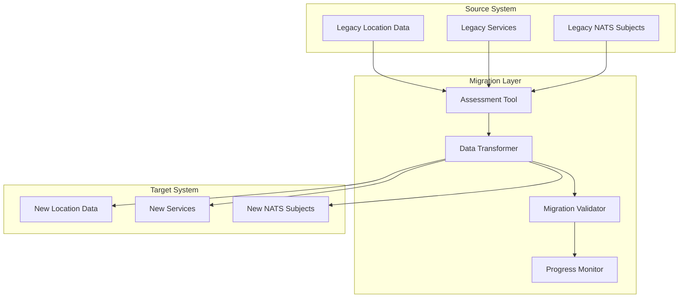

# CIM Location Domain Migration and Upgrade Guide

## Table of Contents
1. [Migration Overview](#migration-overview)
2. [Version Compatibility](#version-compatibility)
3. [Pre-Migration Planning](#pre-migration-planning)
4. [Data Migration](#data-migration)
5. [Schema Evolution](#schema-evolution)
6. [Service Migration](#service-migration)
7. [NATS Subject Migration](#nats-subject-migration)
8. [Workflow Migration](#workflow-migration)
9. [Performance Considerations](#performance-considerations)
10. [Rollback Procedures](#rollback-procedures)
11. [Testing Migration](#testing-migration)
12. [Production Migration](#production-migration)

## Migration Overview

This guide provides comprehensive instructions for migrating between versions of the CIM Location Domain, including data migration, service upgrades, and compatibility considerations.

### Migration Types

1. **Major Version Migrations**: Breaking changes requiring careful planning
2. **Minor Version Migrations**: Feature additions with backward compatibility
3. **Patch Migrations**: Bug fixes and minor improvements
4. **Data Format Migrations**: Changes to location data structures
5. **Infrastructure Migrations**: NATS subject changes, database schema updates

### Migration Architecture



## Version Compatibility

### Version Support Matrix

| Source Version | Target Version | Migration Type | Support Level | Migration Tool |
|----------------|----------------|----------------|---------------|----------------|
| 0.1.x          | 0.2.x          | Minor          | Full          | Auto           |
| 0.1.x          | 1.0.x          | Major          | Full          | Assisted       |
| 1.0.x          | 1.1.x          | Minor          | Full          | Auto           |
| 1.0.x          | 2.0.x          | Major          | Full          | Manual         |

### Breaking Changes by Version

#### Version 2.0.0
- **NATS Subject Schema**: Updated to hierarchical pattern
- **Location Data Structure**: Added required `metadata` field
- **Service Interface**: Changed async trait signatures
- **Workflow System**: Replaced state machine implementation

#### Version 1.1.0
- **Geofence Types**: Added polygon and multi-polygon support
- **Coordinate System**: Added CRS support
- **Performance**: Spatial indexing improvements

#### Version 1.0.0
- **Initial Stable Release**: Established core API contracts

## Pre-Migration Planning

### Migration Assessment Tool

```rust
use cim_domain_location::migration::{
    MigrationAssessment, AssessmentReport, CompatibilityCheck
};

pub struct LocationMigrationAssessment {
    source_version: String,
    target_version: String,
    data_analyzer: DataAnalyzer,
    compatibility_checker: CompatibilityChecker,
}

impl LocationMigrationAssessment {
    pub async fn assess_migration_feasibility(
        &self,
        source_system: &SourceSystem
    ) -> Result<AssessmentReport, AssessmentError> {
        let mut assessment = AssessmentReport::new();
        
        // Analyze data compatibility
        let data_issues = self.analyze_data_compatibility(source_system).await?;
        assessment.add_data_issues(data_issues);
        
        // Check service compatibility
        let service_issues = self.check_service_compatibility(source_system).await?;
        assessment.add_service_issues(service_issues);
        
        // Analyze NATS subject compatibility
        let subject_issues = self.check_nats_compatibility(source_system).await?;
        assessment.add_subject_issues(subject_issues);
        
        // Estimate migration effort
        let effort_estimate = self.estimate_migration_effort(&assessment);
        assessment.set_effort_estimate(effort_estimate);
        
        // Generate recommendations
        let recommendations = self.generate_migration_recommendations(&assessment);
        assessment.set_recommendations(recommendations);
        
        Ok(assessment)
    }
    
    async fn analyze_data_compatibility(
        &self,
        source_system: &SourceSystem
    ) -> Result<Vec<DataIssue>, AnalysisError> {
        let mut issues = Vec::new();
        
        // Check location data structure
        let location_samples = source_system.sample_locations(1000).await?;
        
        for location in location_samples {
            // Check for missing required fields
            if self.target_version >= "2.0.0" && location.metadata.is_none() {
                issues.push(DataIssue::MissingRequiredField {
                    field: "metadata".to_string(),
                    location_id: location.id.clone(),
                    severity: Severity::High,
                });
            }
            
            // Check coordinate system compatibility
            if location.coordinates.crs.is_none() && self.requires_crs() {
                issues.push(DataIssue::MissingCRS {
                    location_id: location.id.clone(),
                    severity: Severity::Medium,
                });
            }
            
            // Check geofence compatibility
            for geofence in &location.geofences {
                if !self.is_geofence_compatible(geofence) {
                    issues.push(DataIssue::IncompatibleGeofence {
                        geofence_id: geofence.id.clone(),
                        reason: "Unsupported geofence type".to_string(),
                        severity: Severity::High,
                    });
                }
            }
        }
        
        Ok(issues)
    }
    
    async fn estimate_migration_effort(&self, assessment: &AssessmentReport) -> MigrationEffort {
        let data_complexity = self.calculate_data_complexity(assessment);
        let service_complexity = self.calculate_service_complexity(assessment);
        let infrastructure_complexity = self.calculate_infrastructure_complexity(assessment);
        
        MigrationEffort {
            estimated_hours: data_complexity + service_complexity + infrastructure_complexity,
            risk_level: self.assess_risk_level(assessment),
            required_resources: self.determine_required_resources(assessment),
            timeline: self.estimate_timeline(assessment),
        }
    }
}

#[derive(Debug)]
pub struct AssessmentReport {
    pub data_issues: Vec<DataIssue>,
    pub service_issues: Vec<ServiceIssue>,
    pub subject_issues: Vec<SubjectIssue>,
    pub effort_estimate: Option<MigrationEffort>,
    pub recommendations: Vec<MigrationRecommendation>,
}

#[derive(Debug)]
pub enum DataIssue {
    MissingRequiredField { field: String, location_id: LocationId, severity: Severity },
    MissingCRS { location_id: LocationId, severity: Severity },
    IncompatibleGeofence { geofence_id: GeofenceId, reason: String, severity: Severity },
    DataFormatMismatch { field: String, expected_format: String, actual_format: String },
}
```

### Migration Planning Checklist

- [ ] **Data Assessment**
  - [ ] Inventory existing location data
  - [ ] Identify data format incompatibilities
  - [ ] Assess data volume and complexity
  - [ ] Plan data transformation requirements

- [ ] **Service Assessment**
  - [ ] Review service interface changes
  - [ ] Identify breaking API changes
  - [ ] Plan service upgrade strategy
  - [ ] Assess downstream dependencies

- [ ] **Infrastructure Assessment**
  - [ ] Review NATS subject changes
  - [ ] Plan database schema updates
  - [ ] Assess storage requirements
  - [ ] Plan network configuration changes

- [ ] **Risk Assessment**
  - [ ] Identify migration risks
  - [ ] Plan rollback procedures
  - [ ] Prepare contingency plans
  - [ ] Schedule maintenance windows

## Data Migration

### Location Data Transformer

```rust
use cim_domain_location::migration::{
    DataTransformer, TransformationRule, TransformationContext
};

pub struct LocationDataTransformer {
    transformation_rules: Vec<Box<dyn TransformationRule>>,
    context: TransformationContext,
}

impl LocationDataTransformer {
    pub fn new(source_version: &str, target_version: &str) -> Self {
        let mut transformer = Self {
            transformation_rules: Vec::new(),
            context: TransformationContext::new(source_version, target_version),
        };
        
        transformer.register_transformation_rules();
        transformer
    }
    
    fn register_transformation_rules(&mut self) {
        // Register version-specific transformation rules
        match (self.context.source_version.as_str(), self.context.target_version.as_str()) {
            ("1.0.x", "2.0.x") => {
                self.transformation_rules.push(Box::new(AddMetadataFieldRule));
                self.transformation_rules.push(Box::new(UpdateNatsSubjectRule));
                self.transformation_rules.push(Box::new(MigrateGeofenceRule));
            },
            ("0.1.x", "1.0.x") => {
                self.transformation_rules.push(Box::new(NormalizeCoordinatesRule));
                self.transformation_rules.push(Box::new(AddLocationHierarchyRule));
            },
            _ => {} // No transformation rules needed
        }
    }
    
    pub async fn transform_location(
        &self,
        source_location: &SourceLocation
    ) -> Result<Location, TransformationError> {
        let mut transformed_location = self.create_base_location(source_location)?;
        
        // Apply transformation rules
        for rule in &self.transformation_rules {
            transformed_location = rule.apply(transformed_location, &self.context).await?;
        }
        
        // Validate transformed location
        self.validate_transformed_location(&transformed_location)?;
        
        Ok(transformed_location)
    }
    
    pub async fn transform_batch(
        &self,
        source_locations: Vec<SourceLocation>,
        batch_size: usize
    ) -> Result<Vec<Location>, TransformationError> {
        let mut transformed_locations = Vec::new();
        
        for batch in source_locations.chunks(batch_size) {
            let batch_results: Result<Vec<_>, _> = futures::future::try_join_all(
                batch.iter().map(|loc| self.transform_location(loc))
            ).await;
            
            transformed_locations.extend(batch_results?);
            
            // Progress reporting
            self.report_progress(transformed_locations.len(), source_locations.len()).await;
        }
        
        Ok(transformed_locations)
    }
}

// Transformation rule for adding metadata field (1.0.x -> 2.0.x)
pub struct AddMetadataFieldRule;

#[async_trait]
impl TransformationRule for AddMetadataFieldRule {
    async fn apply(
        &self,
        mut location: Location,
        context: &TransformationContext
    ) -> Result<Location, TransformationError> {
        if location.metadata.is_none() {
            // Create default metadata from available information
            let metadata = LocationMetadata::default()
                .with_type(self.infer_location_type(&location))
                .with_created_at(Utc::now())
                .with_source("migration");
            
            location.metadata = Some(metadata);
        }
        
        Ok(location)
    }
    
    fn infer_location_type(&self, location: &Location) -> LocationType {
        // Infer type from location name or other attributes
        if location.name.to_lowercase().contains("restaurant") {
            LocationType::Restaurant
        } else if location.name.to_lowercase().contains("hotel") {
            LocationType::Hotel
        } else {
            LocationType::PointOfInterest
        }
    }
}

// Transformation rule for migrating geofences
pub struct MigrateGeofenceRule;

#[async_trait]
impl TransformationRule for MigrateGeofenceRule {
    async fn apply(
        &self,
        mut location: Location,
        context: &TransformationContext
    ) -> Result<Location, TransformationError> {
        for geofence in &mut location.geofences {
            // Migrate geofence format if necessary
            geofence.geometry = self.migrate_geofence_geometry(&geofence.geometry)?;
            
            // Update geofence metadata
            if geofence.metadata.is_none() {
                geofence.metadata = Some(GeofenceMetadata {
                    created_at: Utc::now(),
                    updated_at: Utc::now(),
                    version: context.target_version.clone(),
                });
            }
        }
        
        Ok(location)
    }
    
    fn migrate_geofence_geometry(
        &self,
        geometry: &GeofenceGeometry
    ) -> Result<GeofenceGeometry, TransformationError> {
        match geometry {
            GeofenceGeometry::LegacyCircle { center, radius } => {
                Ok(GeofenceGeometry::Circle(Circle::new(*center, *radius)))
            },
            GeofenceGeometry::LegacyPolygon { points } => {
                Ok(GeofenceGeometry::Polygon(Polygon::new(points.clone())))
            },
            // Already in new format
            geometry => Ok(geometry.clone()),
        }
    }
}
```

### Batch Migration Process

```rust
pub struct BatchMigrationManager {
    transformer: LocationDataTransformer,
    source_repository: Box<dyn LocationRepository>,
    target_repository: Box<dyn LocationRepository>,
    progress_reporter: ProgressReporter,
}

impl BatchMigrationManager {
    pub async fn migrate_all_locations(
        &self,
        migration_config: &MigrationConfig
    ) -> Result<MigrationReport, MigrationError> {
        let total_locations = self.source_repository.count_locations().await?;
        let batch_size = migration_config.batch_size;
        
        let mut migration_report = MigrationReport::new();
        let mut processed = 0;
        let mut offset = 0;
        
        while processed < total_locations {
            // Fetch batch from source
            let source_batch = self.source_repository
                .get_locations_batch(offset, batch_size)
                .await?;
            
            if source_batch.is_empty() {
                break;
            }
            
            // Transform batch
            let transformed_batch = self.transformer
                .transform_batch(source_batch.clone(), batch_size)
                .await;
            
            match transformed_batch {
                Ok(locations) => {
                    // Store in target system
                    let store_result = self.target_repository
                        .store_locations_batch(&locations)
                        .await;
                    
                    match store_result {
                        Ok(_) => {
                            migration_report.successful_migrations += locations.len();
                            processed += locations.len();
                        },
                        Err(e) => {
                            migration_report.failed_migrations += locations.len();
                            migration_report.errors.push(e);
                            
                            // Store failed locations for retry
                            self.store_failed_locations(&source_batch, &e).await?;
                        }
                    }
                },
                Err(e) => {
                    migration_report.failed_migrations += source_batch.len();
                    migration_report.errors.push(e.into());
                }
            }
            
            // Update progress
            self.progress_reporter.report_progress(
                processed,
                total_locations,
                &migration_report
            ).await?;
            
            offset += batch_size;
        }
        
        migration_report.total_processed = processed;
        Ok(migration_report)
    }
    
    pub async fn retry_failed_migrations(
        &self,
        failed_migration_ids: Vec<LocationId>
    ) -> Result<MigrationReport, MigrationError> {
        let mut retry_report = MigrationReport::new();
        
        for location_id in failed_migration_ids {
            match self.migrate_single_location(&location_id).await {
                Ok(_) => {
                    retry_report.successful_migrations += 1;
                },
                Err(e) => {
                    retry_report.failed_migrations += 1;
                    retry_report.errors.push(e);
                }
            }
        }
        
        Ok(retry_report)
    }
}

#[derive(Debug)]
pub struct MigrationReport {
    pub total_processed: usize,
    pub successful_migrations: usize,
    pub failed_migrations: usize,
    pub errors: Vec<MigrationError>,
    pub start_time: DateTime<Utc>,
    pub end_time: Option<DateTime<Utc>>,
    pub performance_metrics: PerformanceMetrics,
}
```

## Schema Evolution

### Database Schema Migration

```sql
-- Migration for Location Domain v2.0.0
-- Add metadata column to locations table

BEGIN TRANSACTION;

-- Add metadata column
ALTER TABLE locations ADD COLUMN metadata JSONB;

-- Create index on metadata for performance
CREATE INDEX idx_locations_metadata_type ON locations USING GIN ((metadata->'type'));
CREATE INDEX idx_locations_metadata_tags ON locations USING GIN ((metadata->'tags'));

-- Migrate existing data to include default metadata
UPDATE locations 
SET metadata = jsonb_build_object(
    'type', CASE 
        WHEN name ILIKE '%restaurant%' THEN 'restaurant'
        WHEN name ILIKE '%hotel%' THEN 'hotel'
        ELSE 'point_of_interest'
    END,
    'created_at', COALESCE(created_at, NOW()),
    'source', 'migration'
)
WHERE metadata IS NULL;

-- Add NOT NULL constraint after data migration
ALTER TABLE locations ALTER COLUMN metadata SET NOT NULL;

-- Update geofences table structure
ALTER TABLE geofences ADD COLUMN geometry_version INTEGER DEFAULT 2;
ALTER TABLE geofences ADD COLUMN metadata JSONB DEFAULT '{}';

-- Create new spatial index with improved performance
DROP INDEX IF EXISTS idx_geofences_geometry;
CREATE INDEX idx_geofences_geometry_v2 ON geofences USING GIST (geometry) WITH (fillfactor=90);

COMMIT;
```

### Location Entity Evolution

```rust
use serde::{Deserialize, Serialize};
use cim_domain_location::migration::VersionedEntity;

// Version 1.0 Location structure
#[derive(Debug, Serialize, Deserialize)]
pub struct LocationV1 {
    pub id: LocationId,
    pub name: String,
    pub coordinates: Coordinates,
    pub address: Option<Address>,
    pub created_at: DateTime<Utc>,
    pub updated_at: DateTime<Utc>,
}

// Version 2.0 Location structure
#[derive(Debug, Serialize, Deserialize)]
pub struct LocationV2 {
    pub id: LocationId,
    pub name: String,
    pub coordinates: Coordinates,
    pub address: Option<Address>,
    pub metadata: LocationMetadata, // New required field
    pub created_at: DateTime<Utc>,
    pub updated_at: DateTime<Utc>,
}

impl VersionedEntity for LocationV1 {
    type Target = LocationV2;
    
    fn migrate(self) -> Result<Self::Target, MigrationError> {
        Ok(LocationV2 {
            id: self.id,
            name: self.name,
            coordinates: self.coordinates,
            address: self.address,
            metadata: LocationMetadata::default()
                .with_created_at(self.created_at)
                .with_source("v1_migration"),
            created_at: self.created_at,
            updated_at: self.updated_at,
        })
    }
}

// Backward compatibility adapter
pub struct LocationAdapter;

impl LocationAdapter {
    pub fn from_v1(v1_location: LocationV1) -> LocationV2 {
        v1_location.migrate().expect("Migration should not fail")
    }
    
    pub fn to_v1(v2_location: LocationV2) -> LocationV1 {
        LocationV1 {
            id: v2_location.id,
            name: v2_location.name,
            coordinates: v2_location.coordinates,
            address: v2_location.address,
            created_at: v2_location.created_at,
            updated_at: v2_location.updated_at,
        }
    }
}
```

## Service Migration

### API Version Management

```rust
use cim_domain_location::services::{LocationService, LocationServiceV1, LocationServiceV2};

pub struct LocationServiceRouter {
    v1_service: LocationServiceV1,
    v2_service: LocationServiceV2,
    version_detector: ApiVersionDetector,
}

impl LocationServiceRouter {
    pub async fn get_location(
        &self,
        location_id: &LocationId,
        request_context: &RequestContext
    ) -> Result<LocationResponse, ServiceError> {
        let api_version = self.version_detector.detect_version(request_context);
        
        match api_version {
            ApiVersion::V1 => {
                let location_v1 = self.v1_service.get_location(location_id).await?;
                Ok(LocationResponse::V1(location_v1))
            },
            ApiVersion::V2 => {
                let location_v2 = self.v2_service.get_location(location_id).await?;
                Ok(LocationResponse::V2(location_v2))
            }
        }
    }
    
    pub async fn create_location(
        &self,
        request: CreateLocationRequest,
        request_context: &RequestContext
    ) -> Result<LocationResponse, ServiceError> {
        let api_version = self.version_detector.detect_version(request_context);
        
        match (api_version, request) {
            (ApiVersion::V1, CreateLocationRequest::V1(req)) => {
                // Convert to V2 internally, then convert back
                let v2_request = self.convert_create_request_v1_to_v2(req);
                let location_v2 = self.v2_service.create_location(v2_request).await?;
                let location_v1 = LocationAdapter::to_v1(location_v2);
                Ok(LocationResponse::V1(location_v1))
            },
            (ApiVersion::V2, CreateLocationRequest::V2(req)) => {
                let location_v2 = self.v2_service.create_location(req).await?;
                Ok(LocationResponse::V2(location_v2))
            },
            _ => Err(ServiceError::IncompatibleVersions)
        }
    }
}

pub struct ApiVersionDetector;

impl ApiVersionDetector {
    pub fn detect_version(&self, context: &RequestContext) -> ApiVersion {
        // Check Accept header
        if let Some(accept) = context.headers.get("Accept") {
            if accept.contains("application/vnd.cim.location.v1+json") {
                return ApiVersion::V1;
            }
            if accept.contains("application/vnd.cim.location.v2+json") {
                return ApiVersion::V2;
            }
        }
        
        // Check API version header
        if let Some(version) = context.headers.get("X-API-Version") {
            if version == "1.0" {
                return ApiVersion::V1;
            }
            if version == "2.0" {
                return ApiVersion::V2;
            }
        }
        
        // Default to latest version
        ApiVersion::V2
    }
}
```

### Service Deprecation Strategy

```rust
pub struct DeprecatedServiceWrapper<T> {
    inner_service: T,
    deprecation_date: DateTime<Utc>,
    sunset_date: DateTime<Utc>,
    migration_guide_url: String,
}

impl<T> DeprecatedServiceWrapper<T>
where
    T: LocationService,
{
    pub fn new(
        inner_service: T,
        deprecation_date: DateTime<Utc>,
        sunset_date: DateTime<Utc>,
        migration_guide_url: String
    ) -> Self {
        Self {
            inner_service,
            deprecation_date,
            sunset_date,
            migration_guide_url,
        }
    }
    
    fn add_deprecation_headers(&self, response: &mut Response) {
        let now = Utc::now();
        
        response.headers.insert(
            "Deprecation",
            self.deprecation_date.to_rfc3339()
        );
        
        response.headers.insert(
            "Sunset",
            self.sunset_date.to_rfc3339()
        );
        
        response.headers.insert(
            "Link",
            format!("<{}>; rel=\"migration-guide\"", self.migration_guide_url)
        );
        
        if now > self.deprecation_date {
            response.headers.insert(
                "Warning",
                "299 - \"This API version is deprecated. Please migrate to v2.\""
            );
        }
        
        if now > self.sunset_date - chrono::Duration::days(30) {
            response.headers.insert(
                "Warning", 
                "299 - \"This API version will be shut down soon. Please migrate immediately.\""
            );
        }
    }
}

#[async_trait]
impl<T> LocationService for DeprecatedServiceWrapper<T>
where
    T: LocationService + Send + Sync,
{
    async fn get_location(
        &self,
        location_id: &LocationId
    ) -> Result<LocationResponse, ServiceError> {
        let mut response = self.inner_service.get_location(location_id).await?;
        self.add_deprecation_headers(&mut response);
        Ok(response)
    }
}
```

## NATS Subject Migration

### Subject Pattern Evolution

```rust
use cim_domain_location::nats::{LocationSubject, SubjectMigration};

pub struct NatsSubjectMigrator {
    source_patterns: Vec<SubjectPattern>,
    target_patterns: Vec<SubjectPattern>,
    migration_rules: Vec<SubjectMigrationRule>,
}

impl NatsSubjectMigrator {
    pub fn new_v1_to_v2() -> Self {
        Self {
            source_patterns: vec![
                // V1 patterns
                SubjectPattern::new("location.event.{type}.{id}"),
                SubjectPattern::new("location.command.{type}.{id}"),
                SubjectPattern::new("location.query.{type}"),
            ],
            target_patterns: vec![
                // V2 patterns
                SubjectPattern::new("events.location.{aggregate}.{event_type}.{entity_id}"),
                SubjectPattern::new("commands.location.{aggregate}.{command_type}.{entity_id}"),
                SubjectPattern::new("queries.location.{aggregate}.{query_type}"),
            ],
            migration_rules: vec![
                SubjectMigrationRule::EventMigration,
                SubjectMigrationRule::CommandMigration,
                SubjectMigrationRule::QueryMigration,
            ],
        }
    }
    
    pub async fn migrate_subscriptions(
        &self,
        nats_client: &async_nats::Client
    ) -> Result<(), SubjectMigrationError> {
        // Get all existing subscriptions
        let existing_subjects = self.discover_existing_subjects(nats_client).await?;
        
        for subject in existing_subjects {
            if let Some(new_subject) = self.migrate_subject(&subject)? {
                // Create new subscription
                let new_subscription = nats_client.subscribe(&new_subject).await?;
                
                // Set up message forwarding from old to new subject
                self.setup_message_forwarding(
                    nats_client,
                    &subject,
                    &new_subject
                ).await?;
                
                // Schedule old subscription cleanup
                self.schedule_cleanup(&subject).await?;
            }
        }
        
        Ok(())
    }
    
    fn migrate_subject(&self, old_subject: &str) -> Result<Option<String>, SubjectMigrationError> {
        for rule in &self.migration_rules {
            if let Some(new_subject) = rule.apply(old_subject)? {
                return Ok(Some(new_subject));
            }
        }
        Ok(None)
    }
    
    async fn setup_message_forwarding(
        &self,
        client: &async_nats::Client,
        old_subject: &str,
        new_subject: &str
    ) -> Result<(), SubjectMigrationError> {
        let mut old_subscription = client.subscribe(old_subject).await?;
        let forwarding_client = client.clone();
        let new_subject = new_subject.to_string();
        
        tokio::spawn(async move {
            while let Some(message) = old_subscription.next().await {
                // Transform message if necessary
                let transformed_payload = transform_message_payload(&message.payload);
                
                // Forward to new subject
                if let Err(e) = forwarding_client.publish(&new_subject, transformed_payload.into()).await {
                    eprintln!("Failed to forward message: {}", e);
                }
            }
        });
        
        Ok(())
    }
}

pub enum SubjectMigrationRule {
    EventMigration,
    CommandMigration,
    QueryMigration,
}

impl SubjectMigrationRule {
    pub fn apply(&self, old_subject: &str) -> Result<Option<String>, SubjectMigrationError> {
        match self {
            SubjectMigrationRule::EventMigration => {
                // Convert "location.event.defined.{id}" to "events.location.location.defined.{id}"
                if old_subject.starts_with("location.event.") {
                    let parts: Vec<&str> = old_subject.split('.').collect();
                    if parts.len() >= 4 {
                        let event_type = parts[2];
                        let entity_id = parts[3];
                        return Ok(Some(format!(
                            "events.location.location.{}.{}",
                            event_type,
                            entity_id
                        )));
                    }
                }
                Ok(None)
            },
            SubjectMigrationRule::CommandMigration => {
                // Similar logic for commands
                if old_subject.starts_with("location.command.") {
                    let parts: Vec<&str> = old_subject.split('.').collect();
                    if parts.len() >= 4 {
                        let command_type = parts[2];
                        let entity_id = parts[3];
                        return Ok(Some(format!(
                            "commands.location.location.{}.{}",
                            command_type,
                            entity_id
                        )));
                    }
                }
                Ok(None)
            },
            SubjectMigrationRule::QueryMigration => {
                // Similar logic for queries
                if old_subject.starts_with("location.query.") {
                    let parts: Vec<&str> = old_subject.split('.').collect();
                    if parts.len() >= 3 {
                        let query_type = parts[2];
                        return Ok(Some(format!(
                            "queries.location.location.{}",
                            query_type
                        )));
                    }
                }
                Ok(None)
            }
        }
    }
}
```

## Workflow Migration

### Workflow Definition Migration

```rust
use cim_domain_location::workflow::{WorkflowDefinition, WorkflowMigrator};

pub struct LocationWorkflowMigrator {
    workflow_repository: Box<dyn WorkflowRepository>,
    definition_transformer: WorkflowDefinitionTransformer,
}

impl LocationWorkflowMigrator {
    pub async fn migrate_workflow_definitions(
        &self
    ) -> Result<WorkflowMigrationReport, WorkflowMigrationError> {
        let existing_definitions = self.workflow_repository
            .get_all_definitions()
            .await?;
            
        let mut migration_report = WorkflowMigrationReport::new();
        
        for definition in existing_definitions {
            match self.migrate_single_definition(definition).await {
                Ok(new_definition) => {
                    self.workflow_repository
                        .store_definition(&new_definition)
                        .await?;
                    migration_report.successful_migrations += 1;
                },
                Err(e) => {
                    migration_report.failed_migrations += 1;
                    migration_report.errors.push(e);
                }
            }
        }
        
        Ok(migration_report)
    }
    
    async fn migrate_single_definition(
        &self,
        old_definition: WorkflowDefinitionV1
    ) -> Result<WorkflowDefinitionV2, WorkflowMigrationError> {
        let mut new_definition = WorkflowDefinitionV2 {
            id: old_definition.id,
            name: old_definition.name,
            version: "2.0".to_string(),
            nodes: Vec::new(),
            transitions: Vec::new(),
            metadata: WorkflowMetadata::default(),
        };
        
        // Migrate nodes
        for old_node in old_definition.nodes {
            let new_node = self.migrate_workflow_node(old_node)?;
            new_definition.nodes.push(new_node);
        }
        
        // Migrate transitions
        for old_transition in old_definition.transitions {
            let new_transition = self.migrate_workflow_transition(old_transition)?;
            new_definition.transitions.push(new_transition);
        }
        
        Ok(new_definition)
    }
    
    fn migrate_workflow_node(
        &self,
        old_node: WorkflowNodeV1
    ) -> Result<WorkflowNodeV2, WorkflowMigrationError> {
        Ok(WorkflowNodeV2 {
            id: old_node.id,
            name: old_node.name,
            node_type: self.migrate_node_type(old_node.node_type)?,
            configuration: self.migrate_node_configuration(old_node.configuration)?,
            timeout: old_node.timeout,
            retry_policy: old_node.retry_policy.map(|p| self.migrate_retry_policy(p)).transpose()?,
        })
    }
    
    fn migrate_node_type(&self, old_type: NodeTypeV1) -> Result<NodeTypeV2, WorkflowMigrationError> {
        match old_type {
            NodeTypeV1::ServiceCall { service_name, method_name } => {
                Ok(NodeTypeV2::ServiceInvocation {
                    service: service_name,
                    operation: method_name,
                    input_mapping: None,
                    output_mapping: None,
                })
            },
            NodeTypeV1::Condition { expression } => {
                Ok(NodeTypeV2::DecisionGateway {
                    condition: self.migrate_condition_expression(expression)?,
                    branches: Vec::new(),
                })
            },
            NodeTypeV1::Parallel { tasks } => {
                Ok(NodeTypeV2::ParallelGateway {
                    branches: tasks.into_iter().map(|t| ParallelBranch {
                        name: t.name,
                        nodes: vec![t.node_id],
                    }).collect(),
                })
            }
        }
    }
}
```

## Performance Considerations

### Migration Performance Optimization

```rust
pub struct MigrationPerformanceOptimizer {
    thread_pool: ThreadPool,
    batch_size_calculator: BatchSizeCalculator,
    memory_monitor: MemoryMonitor,
}

impl MigrationPerformanceOptimizer {
    pub async fn optimize_migration_performance(
        &self,
        migration_context: &MigrationContext
    ) -> MigrationOptimization {
        let system_resources = self.assess_system_resources().await;
        let data_characteristics = self.analyze_data_characteristics(migration_context).await;
        
        MigrationOptimization {
            optimal_batch_size: self.calculate_optimal_batch_size(&system_resources, &data_characteristics),
            thread_count: self.calculate_optimal_thread_count(&system_resources),
            memory_allocation: self.calculate_memory_allocation(&system_resources),
            checkpoint_frequency: self.calculate_checkpoint_frequency(&data_characteristics),
        }
    }
    
    pub async fn monitor_migration_performance(
        &self,
        migration_session: &MigrationSession
    ) -> PerformanceMetrics {
        PerformanceMetrics {
            records_per_second: migration_session.calculate_throughput(),
            memory_usage: self.memory_monitor.get_current_usage(),
            cpu_usage: self.get_cpu_usage(),
            io_wait_time: self.get_io_wait_time(),
            error_rate: migration_session.calculate_error_rate(),
        }
    }
    
    pub async fn adjust_performance_parameters(
        &mut self,
        current_metrics: &PerformanceMetrics,
        target_metrics: &PerformanceMetrics
    ) -> PerformanceAdjustment {
        let mut adjustments = PerformanceAdjustment::new();
        
        // Adjust batch size based on throughput
        if current_metrics.records_per_second < target_metrics.records_per_second * 0.8 {
            if current_metrics.memory_usage < 0.8 {
                adjustments.increase_batch_size(1.2);
            }
        } else if current_metrics.memory_usage > 0.9 {
            adjustments.decrease_batch_size(0.8);
        }
        
        // Adjust thread count based on CPU usage
        if current_metrics.cpu_usage < 0.7 && current_metrics.error_rate < 0.01 {
            adjustments.increase_thread_count(1);
        } else if current_metrics.cpu_usage > 0.9 {
            adjustments.decrease_thread_count(1);
        }
        
        adjustments
    }
}
```

## Rollback Procedures

### Migration Rollback Strategy

```rust
pub struct MigrationRollbackManager {
    backup_repository: Box<dyn BackupRepository>,
    rollback_strategy: RollbackStrategy,
    state_manager: RollbackStateManager,
}

impl MigrationRollbackManager {
    pub async fn create_rollback_point(
        &self,
        migration_id: &MigrationId
    ) -> Result<RollbackPointId, RollbackError> {
        let rollback_point = RollbackPoint {
            id: RollbackPointId::new(),
            migration_id: migration_id.clone(),
            timestamp: Utc::now(),
            system_state: self.capture_system_state().await?,
            data_snapshot: self.create_data_snapshot().await?,
        };
        
        self.backup_repository.store_rollback_point(&rollback_point).await?;
        
        Ok(rollback_point.id)
    }
    
    pub async fn rollback_migration(
        &self,
        rollback_point_id: &RollbackPointId
    ) -> Result<RollbackResult, RollbackError> {
        let rollback_point = self.backup_repository
            .get_rollback_point(rollback_point_id)
            .await?;
        
        let rollback_plan = self.create_rollback_plan(&rollback_point).await?;
        
        // Execute rollback steps
        let mut rollback_result = RollbackResult::new();
        
        for step in rollback_plan.steps {
            match self.execute_rollback_step(step).await {
                Ok(_) => rollback_result.successful_steps += 1,
                Err(e) => {
                    rollback_result.failed_steps += 1;
                    rollback_result.errors.push(e);
                    
                    // Stop on critical error
                    if rollback_result.has_critical_errors() {
                        break;
                    }
                }
            }
        }
        
        // Verify rollback success
        if self.verify_rollback_success(&rollback_point).await? {
            rollback_result.status = RollbackStatus::Success;
        } else {
            rollback_result.status = RollbackStatus::PartialFailure;
        }
        
        Ok(rollback_result)
    }
    
    async fn create_rollback_plan(
        &self,
        rollback_point: &RollbackPoint
    ) -> Result<RollbackPlan, RollbackError> {
        let mut plan = RollbackPlan::new();
        
        // Step 1: Stop migration processes
        plan.add_step(RollbackStep::StopMigrationProcesses);
        
        // Step 2: Restore database schema
        plan.add_step(RollbackStep::RestoreSchema {
            backup_id: rollback_point.data_snapshot.schema_backup_id.clone(),
        });
        
        // Step 3: Restore data
        plan.add_step(RollbackStep::RestoreData {
            backup_id: rollback_point.data_snapshot.data_backup_id.clone(),
        });
        
        // Step 4: Restore service configuration
        plan.add_step(RollbackStep::RestoreServiceConfig {
            config_backup_id: rollback_point.system_state.service_config_id.clone(),
        });
        
        // Step 5: Restart services
        plan.add_step(RollbackStep::RestartServices);
        
        // Step 6: Verify system health
        plan.add_step(RollbackStep::VerifySystemHealth);
        
        Ok(plan)
    }
    
    async fn execute_rollback_step(
        &self,
        step: RollbackStep
    ) -> Result<(), RollbackError> {
        match step {
            RollbackStep::StopMigrationProcesses => {
                self.stop_migration_processes().await
            },
            RollbackStep::RestoreSchema { backup_id } => {
                self.restore_database_schema(&backup_id).await
            },
            RollbackStep::RestoreData { backup_id } => {
                self.restore_database_data(&backup_id).await
            },
            RollbackStep::RestoreServiceConfig { config_backup_id } => {
                self.restore_service_configuration(&config_backup_id).await
            },
            RollbackStep::RestartServices => {
                self.restart_services().await
            },
            RollbackStep::VerifySystemHealth => {
                self.verify_system_health().await
            }
        }
    }
}

#[derive(Debug)]
pub struct RollbackPoint {
    pub id: RollbackPointId,
    pub migration_id: MigrationId,
    pub timestamp: DateTime<Utc>,
    pub system_state: SystemState,
    pub data_snapshot: DataSnapshot,
}

#[derive(Debug)]
pub enum RollbackStep {
    StopMigrationProcesses,
    RestoreSchema { backup_id: BackupId },
    RestoreData { backup_id: BackupId },
    RestoreServiceConfig { config_backup_id: BackupId },
    RestartServices,
    VerifySystemHealth,
}
```

## Testing Migration

### Migration Testing Framework

```rust
use tokio_test;

pub struct MigrationTestSuite {
    test_data_generator: TestDataGenerator,
    migration_validator: MigrationValidator,
    performance_tester: PerformanceTester,
}

impl MigrationTestSuite {
    pub async fn run_comprehensive_migration_test(
        &self,
        source_version: &str,
        target_version: &str
    ) -> Result<MigrationTestReport, TestError> {
        let mut test_report = MigrationTestReport::new();
        
        // Test 1: Data transformation correctness
        let transformation_result = self.test_data_transformation(
            source_version,
            target_version
        ).await?;
        test_report.add_test_result("data_transformation", transformation_result);
        
        // Test 2: Schema migration
        let schema_result = self.test_schema_migration(
            source_version,
            target_version
        ).await?;
        test_report.add_test_result("schema_migration", schema_result);
        
        // Test 3: Service compatibility
        let service_result = self.test_service_compatibility(
            source_version,
            target_version
        ).await?;
        test_report.add_test_result("service_compatibility", service_result);
        
        // Test 4: Performance impact
        let performance_result = self.test_migration_performance(
            source_version,
            target_version
        ).await?;
        test_report.add_test_result("performance", performance_result);
        
        // Test 5: Rollback functionality
        let rollback_result = self.test_rollback_functionality(
            source_version,
            target_version
        ).await?;
        test_report.add_test_result("rollback", rollback_result);
        
        Ok(test_report)
    }
    
    async fn test_data_transformation(
        &self,
        source_version: &str,
        target_version: &str
    ) -> Result<TestResult, TestError> {
        // Generate test data for source version
        let test_locations = self.test_data_generator
            .generate_locations(source_version, 1000)
            .await?;
        
        // Create transformer
        let transformer = LocationDataTransformer::new(source_version, target_version);
        
        // Test transformation
        let mut successful_transformations = 0;
        let mut failed_transformations = 0;
        let mut validation_errors = Vec::new();
        
        for location in test_locations {
            match transformer.transform_location(&location).await {
                Ok(transformed_location) => {
                    // Validate transformed location
                    match self.migration_validator.validate_location(&transformed_location).await {
                        Ok(_) => successful_transformations += 1,
                        Err(e) => {
                            validation_errors.push(e);
                            failed_transformations += 1;
                        }
                    }
                },
                Err(e) => {
                    failed_transformations += 1;
                    validation_errors.push(MigrationError::TransformationFailed(e));
                }
            }
        }
        
        let success_rate = successful_transformations as f64 / 
                          (successful_transformations + failed_transformations) as f64;
        
        Ok(TestResult {
            success_rate,
            successful_operations: successful_transformations,
            failed_operations: failed_transformations,
            errors: validation_errors,
            performance_metrics: None,
        })
    }
    
    async fn test_migration_performance(
        &self,
        source_version: &str,
        target_version: &str
    ) -> Result<TestResult, TestError> {
        // Generate large dataset for performance testing
        let large_dataset = self.test_data_generator
            .generate_locations(source_version, 10_000)
            .await?;
        
        let transformer = LocationDataTransformer::new(source_version, target_version);
        
        // Measure transformation performance
        let start_time = std::time::Instant::now();
        let start_memory = self.get_memory_usage();
        
        let batch_size = 100;
        let mut total_processed = 0;
        
        for batch in large_dataset.chunks(batch_size) {
            let _transformed_batch = transformer
                .transform_batch(batch.to_vec(), batch_size)
                .await?;
            total_processed += batch.len();
        }
        
        let end_time = std::time::Instant::now();
        let end_memory = self.get_memory_usage();
        
        let duration = end_time - start_time;
        let throughput = total_processed as f64 / duration.as_secs_f64();
        let memory_usage = end_memory - start_memory;
        
        Ok(TestResult {
            success_rate: 1.0,
            successful_operations: total_processed,
            failed_operations: 0,
            errors: Vec::new(),
            performance_metrics: Some(PerformanceMetrics {
                throughput,
                duration,
                memory_usage,
                cpu_usage: 0.0, // Would be measured in real implementation
            }),
        })
    }
}

#[tokio::test]
async fn test_location_v1_to_v2_migration() {
    let migration_suite = MigrationTestSuite::new();
    
    let test_report = migration_suite
        .run_comprehensive_migration_test("1.0", "2.0")
        .await
        .expect("Migration test should succeed");
    
    // Assert minimum success rates
    assert!(test_report.get_test_success_rate("data_transformation") > 0.99);
    assert!(test_report.get_test_success_rate("schema_migration") > 0.99);
    assert!(test_report.get_test_success_rate("service_compatibility") > 0.95);
    
    // Assert performance requirements
    let performance_metrics = test_report.get_performance_metrics("performance").unwrap();
    assert!(performance_metrics.throughput > 100.0); // At least 100 records/second
}
```

## Production Migration

### Production Migration Checklist

- [ ] **Pre-Migration**
  - [ ] Complete migration assessment
  - [ ] Create comprehensive backup
  - [ ] Set up monitoring and alerts
  - [ ] Prepare rollback procedures
  - [ ] Schedule maintenance window
  - [ ] Notify stakeholders

- [ ] **Migration Execution**
  - [ ] Stop non-critical services
  - [ ] Create rollback point
  - [ ] Execute data migration in batches
  - [ ] Validate migrated data
  - [ ] Update service configurations
  - [ ] Test critical functionality

- [ ] **Post-Migration**
  - [ ] Monitor system performance
  - [ ] Verify data integrity
  - [ ] Test all services
  - [ ] Update documentation
  - [ ] Clean up temporary resources
  - [ ] Schedule old version cleanup

### Production Migration Script

```bash
#!/bin/bash

# CIM Location Domain Production Migration Script
# Usage: ./migrate_production.sh <source_version> <target_version>

set -euo pipefail

SOURCE_VERSION=$1
TARGET_VERSION=$2
MIGRATION_LOG="/var/log/cim/migration_${SOURCE_VERSION}_to_${TARGET_VERSION}.log"
BACKUP_DIR="/backup/cim/location/$(date +%Y%m%d_%H%M%S)"

log() {
    echo "[$(date '+%Y-%m-%d %H:%M:%S')] $1" | tee -a "$MIGRATION_LOG"
}

create_backup() {
    log "Creating backup in $BACKUP_DIR"
    mkdir -p "$BACKUP_DIR"
    
    # Backup database
    pg_dump -h localhost -U cim_user cim_location > "$BACKUP_DIR/database_backup.sql"
    
    # Backup configuration
    cp -r /etc/cim/location/ "$BACKUP_DIR/config/"
    
    # Backup NATS data
    nats-streaming-server --store_limits_subs=0 --backup_dir="$BACKUP_DIR/nats"
    
    log "Backup completed successfully"
}

validate_prerequisites() {
    log "Validating prerequisites"
    
    # Check system resources
    if [[ $(free -m | awk 'NR==2{print $7}') -lt 1000 ]]; then
        log "ERROR: Insufficient memory (less than 1GB available)"
        exit 1
    fi
    
    # Check disk space
    if [[ $(df / | awk 'NR==2{print $4}') -lt 5000000 ]]; then
        log "ERROR: Insufficient disk space (less than 5GB available)"
        exit 1
    fi
    
    # Verify services are running
    systemctl is-active --quiet postgresql || {
        log "ERROR: PostgreSQL is not running"
        exit 1
    }
    
    systemctl is-active --quiet nats-server || {
        log "ERROR: NATS server is not running"
        exit 1
    }
    
    log "Prerequisites validated successfully"
}

execute_migration() {
    log "Starting migration from $SOURCE_VERSION to $TARGET_VERSION"
    
    # Run migration tool
    cim-location-migrator \
        --source-version="$SOURCE_VERSION" \
        --target-version="$TARGET_VERSION" \
        --batch-size=1000 \
        --log-file="$MIGRATION_LOG" \
        --backup-dir="$BACKUP_DIR"
    
    if [[ $? -eq 0 ]]; then
        log "Migration completed successfully"
    else
        log "ERROR: Migration failed"
        exit 1
    fi
}

validate_migration() {
    log "Validating migration results"
    
    # Run validation tool
    cim-location-validator \
        --target-version="$TARGET_VERSION" \
        --log-file="$MIGRATION_LOG"
    
    if [[ $? -eq 0 ]]; then
        log "Migration validation passed"
    else
        log "ERROR: Migration validation failed"
        exit 1
    fi
}

cleanup() {
    log "Performing cleanup"
    
    # Remove temporary files
    rm -rf /tmp/cim_migration_*
    
    # Restart services
    systemctl restart cim-location-service
    
    log "Cleanup completed"
}

main() {
    log "Starting CIM Location Domain migration"
    
    validate_prerequisites
    create_backup
    execute_migration
    validate_migration
    cleanup
    
    log "Migration completed successfully"
}

# Set trap for cleanup on exit
trap cleanup EXIT

main "$@"
```

This comprehensive migration and upgrade guide provides detailed procedures for safely migrating between versions of the CIM Location Domain, ensuring data integrity, service continuity, and system reliability throughout the migration process.